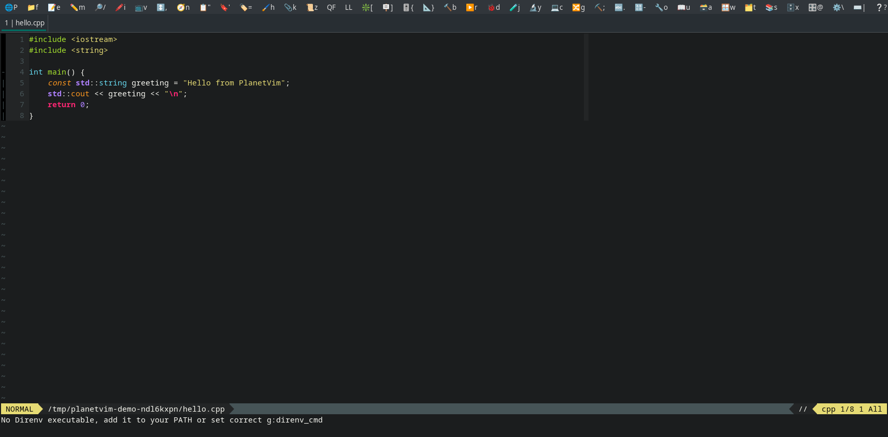

# PlanetVim

PlanetVim is a **GVim distribution for Linux and Windows**, with discoverable menus for editing, projects, Git, SDK tools, testing, debugging, and writing. Linux is the primary platform. macOS, terminal Vim, and Neovim are outside this release's scope.

The current version is **0.1.0-rc.1**. See [the acceptance record](docs/ACCEPTANCE.md) for what has actually been exercised and what still needs platform or SDK validation. Menu actions are implemented and enabled; optional tools report their prerequisites when selected.



## Start from a checkout

Install GVim **9.1 or newer** with GUI, menus, terminal, jobs, channels, timers, and persistent undo, plus Python 3.10 or newer for the installer and project generators. Debugging additionally requires a working GVim `+python3` provider. You can inspect a build with `gvim --version`.

```sh
git clone https://github.com/fedorenchik/PlanetVim.git
cd PlanetVim
gvim -u scripts/planetvim.vim
```

On Windows, run the same GVim command from PowerShell or use the full path to `gvim.exe`. Use the private launcher below for normal use. Start with `:PlanetDoctor` and `:help planetvim`. `:PlanetPlainMenus` provides text menu labels if emoji rendering is poor.

## Install, update, and remove

To make plain `/usr/bin/gvim` load PlanetVim on Linux:

```sh
make preview
make install
/usr/bin/gvim
```

This keeps the distribution in `~/.local/share/planetvim` and installs a small
loader at `~/.vimrc`. An existing startup file or symlink is backed up first;
`make uninstall` restores it. `make update` remembers this mode, and `make restore`
undoes the most recent operation. Use `PREFIX="/your/private/PlanetVim"` with each
command for a custom distribution location. Do not use your home itself as PREFIX.

The equivalent Python command is `python3 scripts/install.py install`.
On Windows use `py -3 scripts/install.py install`; the loader is
installed at `$HOME/_vimrc` (normally your user profile), or an existing `.vimrc`.
An already managed PlanetVim installation is updated without replacing its
original personal-config backup. Restart GVim after install
or update. See [home startup and recovery](docs/GUIDE.md#home-startup-and-recovery)
for customization and preservation behavior.

For a private installation that you launch separately on Linux:

```sh
make preview-private
make install-private
~/.local/share/planetvim/bin/planetvim
```

Windows PowerShell:

```powershell
py -3 scripts/install.py install --private --dry-run
py -3 scripts/install.py install --private
& "$env:LOCALAPPDATA\PlanetVim\bin\planetvim.cmd"
```

The distribution always lives in a private directory. Default installation manages the home startup file; `install-private` or `--private` keeps home startup unchanged. Your existing `.vim`/`vimfiles` directory is left alone in both modes. Use `--prefix "/path with spaces/PlanetVim"` to choose another location; pass the same prefix to later operations. Put its `bin` directory on PATH if you want a `planetvim` command. `PLANETVIM_GVIM` may name a particular GVim executable for that launcher.

From a newer checkout or extracted release:

```sh
python3 scripts/install.py update --dry-run
python3 scripts/install.py update
python3 scripts/install.py uninstall --dry-run
python3 scripts/install.py uninstall
python3 scripts/install.py restore
```

`restore` rolls back the latest transaction. The installer reports the backup directory, preserves locally modified files during uninstall, and retains backups for recovery. An update backs up replaced content. Keep customization in the private config directory rather than editing installed files. Windows uses `py -3` in place of `python3` in these examples.

## Everyday use

The PlanetVim menu selects **Easy**, **Standard**, or **Supercharged** mode. Standard is the default. Easy starts in Insert mode and uses shifted arrow keys for selection. Supercharged remaps navigation keys; read [the mode guide](docs/GUIDE.md#editing-modes) before choosing it. Mode changes and menu preferences persist.

- **File** creates projects/files, saves, exports exact selections, and changes directories.
- **View** opens the Fern file browser, LSP/tags views, quickfix, and window-bar controls.
- **Build / Run / Debug / Test / Analyze** operate on the current tab's project. Use `:tcd /path/to/project` to select it.
- **Git** operates on the saved file's repository. Network, commit, deployment, and installation actions run only when selected.
- **Writing / Spell Check** provide Markdown/LaTeX builds, prose tools, translation, spelling, and grammar checking.
- **Sessions** saves and reopens layouts; closing and reopening a tab restores its own snapshot.

Commands show output, working directory, and exit status in a GVim terminal buffer. `:PlanetCommandResult` describes the current output and `:PlanetCommandCancel` stops its job. Failed commands remain available for inspection.

## First projects

For C++: select **File → New Project → CMake**, choose a new directory, then select **Build → CMake → Create In-Tree Build Dir**, **Configure**, and **Build**. The generated project includes a CTest test. **Test → CTest** runs it. Generate `compile_commands.json` from the CMake menu for clangd. Add a Run profile with native arguments, for example:

```json
{"name":"hello","argv":["./build/hello"],"cwd":"."}
```

On Windows, use the actual `.exe` output path, including the configuration subdirectory for a multi-configuration generator. Run profiles belong to the tab's project and are stored in private state.

For Python: select **File → New Project → Python**, then open `test_main.py` and run `:PlanetTest file`. Install `python-lsp-server[all]` in your chosen Python environment for completion, diagnostics, and formatting; point `g:PV_pylsp_argv` to its executable. `:PlanetDebugSetup python` creates a reviewable `.vimspector.json`; install debugpy into the configured adapter's Python environment before launching.

For writing: save a Markdown document and run `:PlanetMarkdownPreview` with Pandoc installed. Save a LaTeX document and use `:PlanetLatexBuild` with latexmk and a TeX distribution. `:PlanetWritingErrors` opens source diagnostics. Personal spell words and generated previews live outside the project.

See [the complete guide](docs/GUIDE.md) for configuration, language intelligence, debugging, writing, sessions, recovery, and troubleshooting. [Development integrations](docs/INTEGRATIONS.md) describes SDK activation, packaging, analyzers, and their external prerequisites. The integration catalog includes the original Linux/Windows ecosystem: Anaconda/Conda, Arduino, Autotools, C++/CMake, Docker, Electron, Flutter, Godot/SCons, GTK, Make/Kbuild, Meson, Ninja, Node/Nuxt/Vue, PlatformIO, Python, Qt, ROS, Vim, WebAssembly, Yocto, and kernel tooling.

## Contributing and validation

```sh
make test
python3 scripts/test.py --gui
python3 scripts/plugins.py inventory --check
```

The GUI suite needs a display; `--xvfb /path/to/Xvfb` creates a private Linux display. Tests use disposable config, state, repositories, and project files. [CONTRIBUTING.md](CONTRIBUTING.md) explains the code layout, integration contracts, and tests. [Plugin maintenance](docs/PLUGINS.md) records bundled sources and revisions. Third-party plugin source is not patched by this implementation.

PlanetVim's first-party code is licensed under [MIT](LICENSE). Bundled plugins keep their own licenses and notices; see [the plugin inventory](docs/plugins.json). [CHANGELOG.md](CHANGELOG.md) records release changes, and [TASKS.md](TASKS.md) tracks the original review work and acceptance limits.
